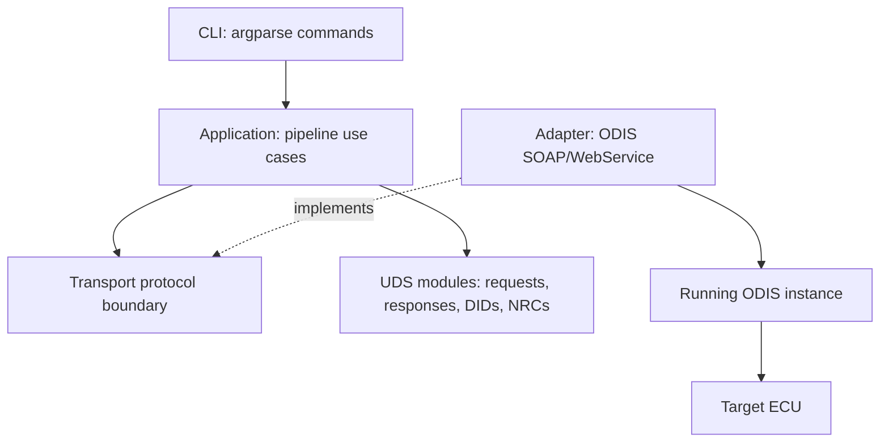
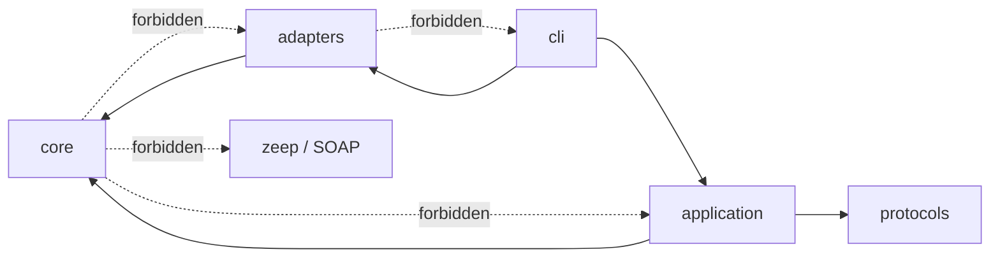
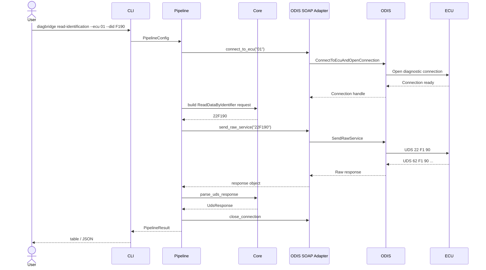

# Architecture

The project is built as a small diagnostic pipeline. The main goal is to prevent SOAP, CLI, and ODIS-specific details from leaking into UDS parsing and request safety rules. Source code is organized by architecture directly under `src`.

## Layer map

## Dependency rules

Rules:

- `core` contains no ODIS, SOAP, CLI, or framework dependency.
- `application` coordinates behavior but does not know Zeep-specific details.
- `adapters` contains external-system SOAP code and the virtual ECU.
- `cli` composes transport plus application use case.

## Runtime sequence

## Main modules

| Module | Responsibility |
| --- | --- |
| `core.hexcodec` | Hex normalization, bytes conversion, printable ASCII rendering. |
| `core.requests` | Build and validate supported UDS requests. |
| `core.responses` | Extract SOAP response data and parse UDS positive/negative responses. |
| `core.dids` | DID catalogue for common identification values. |
| `core.nrc` | Negative response code descriptions. |
| `adapters.protocols` | Transport interface expected by the pipeline. |
| `adapters.odis_soap` | Zeep/ODIS SOAP binding and operation alias fallback. |
| `adapters.virtual_ecu` | In-process ECU simulator for local tests. |
| `application.pipeline` | Identification and ECU reset orchestration. |
| `application.reporting` | Table and JSON rendering. |
| `cli.main` | Command-line argument parsing and composition. |

## Why this shape

ODIS SOAP signatures differ between installations. The project isolates that instability in `adapters.odis_soap`. If your WSDL uses different operation names or argument names, you change the adapter without touching UDS parsing or pipeline logic.
