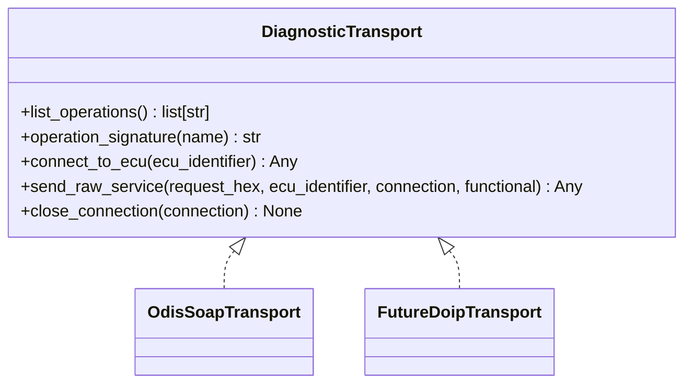

# Development notes

## Run tests

```bash
pytest
```

## Structural invariants

Keep these rules intact:

1. `core` must not import Zeep, SOAP, argparse, or ODIS-specific modules.
2. `application` must depend on the transport protocol, not the concrete SOAP adapter.
3. `adapters.odis_soap` is the only module that should import `zeep`.
4. CLI code must not parse UDS responses directly.
5. Safety validation must happen before a request reaches the transport.

## Test pressure points

Tests should cover:

- malformed hex input;
- blocked unsafe service IDs;
- positive DID responses;
- negative responses and NRC decoding;
- response extraction from string, dict, list, and object-like SOAP shapes;
- pipeline ordering and cleanup.

## Adding a new transport

Create another adapter that implements `DiagnosticTransport`:



The application layer should not change when a transport is replaced.
