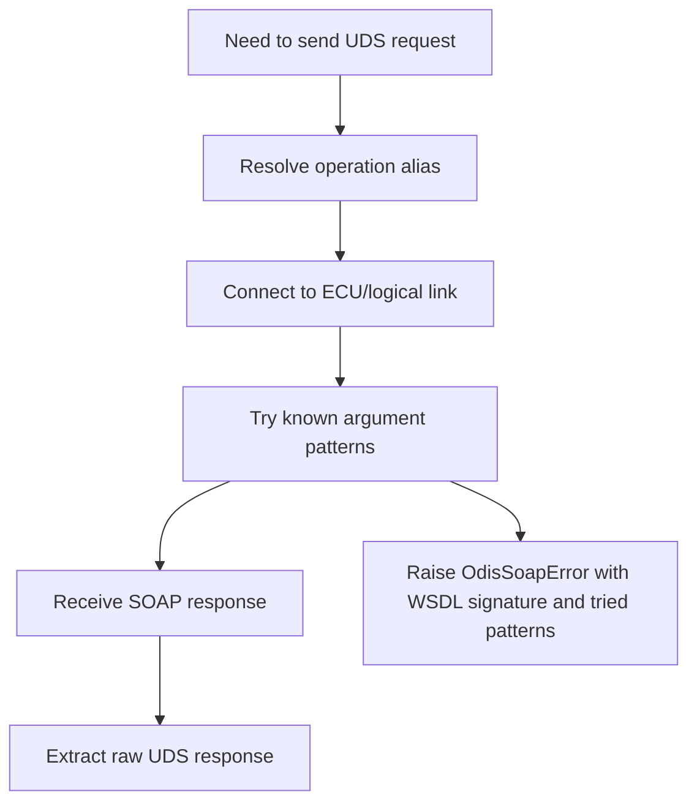

# ODIS WebService integration

The adapter assumes that a running ODIS installation exposes a SOAP/WSDL endpoint. The default used by this project is:

```text
http://127.0.0.1:8081/?wsdl
```

Your installation may use a different path, for example:

```text
http://127.0.0.1:8081/ODISService?wsdl
http://127.0.0.1:8081/OffboardDiagService?wsdl
```

## Operation discovery

The command below prints the operations and signatures from the WSDL:

```bash
diagbridge --wsdl "http://127.0.0.1:8081/?wsdl" list-ops
```

## Adapter fallback strategy

The SOAP adapter tries several common operation aliases because ODIS project/version combinations may differ.



## What `--ecu` means

The `--ecu` value is not guaranteed to be a raw CAN diagnostic address. Depending on the ODIS project and WSDL, it may be:

- ECU short name.
- ODX logical link name.
- Diagnostic address string.
- Control unit identifier from the loaded project.

Use `list-ops` first and inspect the connection operation signature.

## Where to adapt for your WSDL

Edit only this file for SOAP compatibility changes:

```text
src/adapters/odis_soap.py
```

Likely change points:

- `CONNECT_ALIASES`
- `SEND_PHYSICAL_ALIASES`
- `SEND_FUNCTIONAL_ALIASES`
- argument patterns in `connect_to_ecu`
- argument patterns in `send_raw_service`

Do not move SOAP-specific code into the UDS parsing modules or pipeline orchestration modules.
