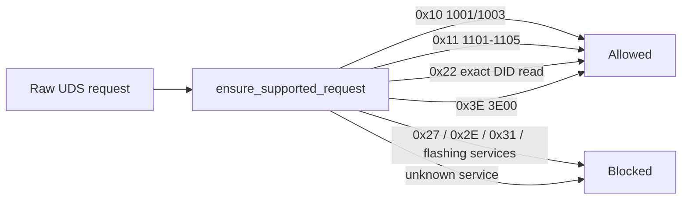

# Safety model

This project is intentionally narrow. It supports ECU identification/version reading plus explicit ECU reset, not coding, adaptation, flashing, security unlocking, or protected function manipulation.

## Allowed services

Allowed:

- `10 01` default diagnostic session.
- `10 03` extended diagnostic session.
- `11 01` hard reset.
- `11 02` key-off-on reset.
- `11 03` soft reset.
- `11 04` enable rapid power shutdown.
- `11 05` disable rapid power shutdown.
- `3E 00` tester present.
- `22 XX YY` read one DID.

Blocked:

- `27` SecurityAccess.
- `2E` WriteDataByIdentifier.
- `31` RoutineControl.
- `34`, `35`, `36`, `37` upload/download/transfer services.
- `3D` WriteMemoryByAddress.
- Any service not explicitly allowed.

## Why the guard exists

The SOAP operation may be named `SendRawService`, but this project does not expose a generic arbitrary-command CLI. Every request passes through `ensure_supported_request` before reaching the SOAP adapter.

ECU reset can interrupt communication and ECU operation. The CLI requires `--confirm-reset` for the `reset-ecu` command.

## Authorized use

Use this project only on vehicles, benches, ECUs, or networks where you have explicit authorization. Diagnostic requests can disturb some ECUs if sent at the wrong time, in the wrong session, or at an unsafe rate.
